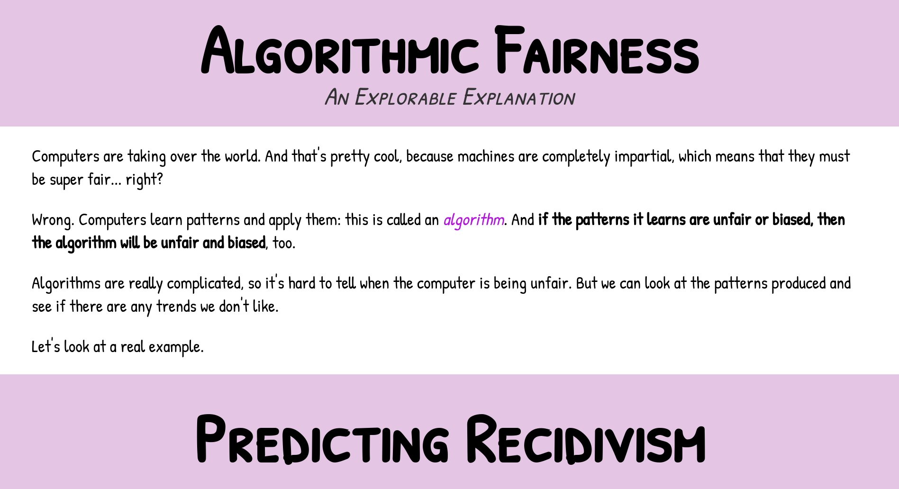

<!--
# Steven G. Opferman | steven.g.opferman@gmail.com
# My personal template for README.md files, because I'm lazy :P
# Adapted from:
#   https://github.com/othneildrew/Best-README-Template/
#   https://github.com/kylelobo/The-Documentation-Compendium/
-->

<h1 align="center">Algorithmic Fairness: An Explorable Explanation</h1>

  

An interactive visual explanation of mathematical definitions of fairness, using the COMPAS algorithm as a case study.
 

## Table of Contents

- [About](#about)
- [Data and Methods](#data_and_methods)
- [Contributing](#contributing)
- [Acknowledgements](#acknowledgements)

## About 

Machine learning models are becoming increasingly prevalent, but are really hard to understand. Because they are so complex, it is easy for hidden bias to arise and difficult to ensure models are fair and just: there's a lot of math and not a lot of intuition. The goal of this project is to illustrate how investigations of models work.

(<a href="#top">back to top</a>)

## Data and Methods 

This explorable explanation visualizes [ProPublica's COMPAS data](https://github.com/propublica/compas-analysis/blob/master/compas-scores-two-years.csv) using [D3.js](https://d3js.org/). I converted the CSV to JSON using [csvjson.com](https://csvjson.com/csv2json), and perform minor data cleaning after loading the data (renaming and [one-hot encoding](https://en.wikipedia.org/wiki/One-hot)).

(<a href="#top">back to top</a>)

## Contributing 

Collaboration is what makes the world such an amazing place to learn, inspire, and create. **Any contributions or suggestions you make are greatly appreciated!**

Feel free to do any of the following:

- send me an [email](mailto:steven.g.opferman@gmail.com)
- open an issue with the tag "enhancement"
- fork the repo and create a pull request

(<a href="#top">back to top</a>)

## Acknowledgements 

- [ProPublica's article](https://www.propublica.org/article/machine-bias-risk-assessments-in-criminal-sentencing), [methodology write-up](https://www.propublica.org/article/how-we-analyzed-the-compas-recidivism-algorithm), and [GitHub](https://github.com/propublica/compas-analysis)
- Content is adapted from [Stanford's CS 182: Ethics, Public Policy, and Technological Change](https://web.stanford.edu/class/cs182/)
- Inspired by [Nicky Case](https://ncase.me/) and [MIT Technology Review's visualization](https://www.technologyreview.com/2019/10/17/75285/ai-fairer-than-judge-criminal-risk-assessment-algorithm/)
- Created for [Stanford's CS 448B: Data Visualization](https://cs448b.subramonyam.com/), Winter 2023

(<a href="#top">back to top</a>)

